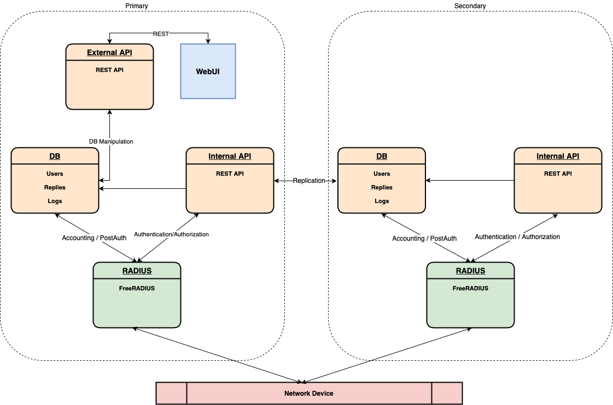
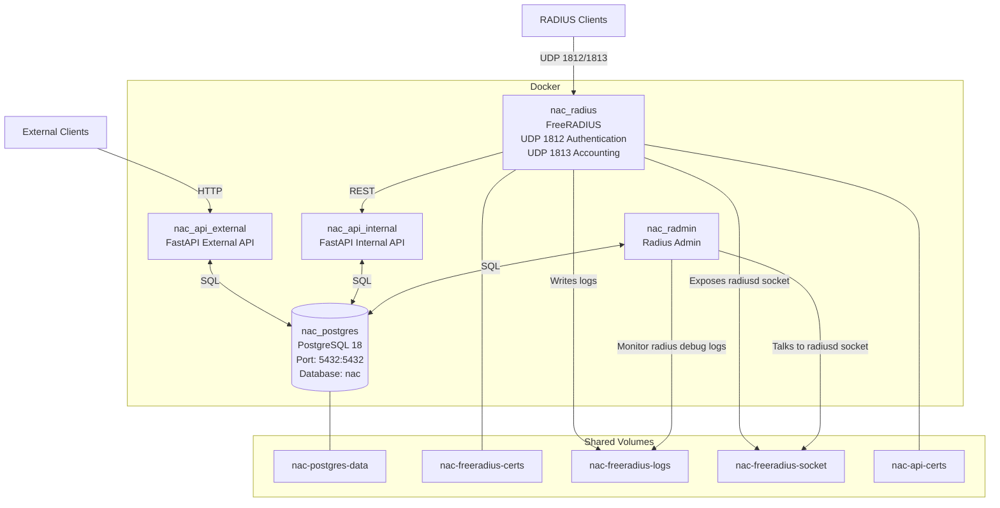

# CNaaS NAC - Network Admission Control  

Software to automate management of a campus network(LAN). This is an
open source software developed as part of SUNETs managed service.

CNaaS NAC provides a way for clients to authenticate themselves using
IEEE 802.1X and MAB.

## Features
- Automatic discovery of MAB clients
- Periodic cleanup of inactive clients.
- Replication between primary and secondary server.
- LDAP integration.
- REST JSON API.
- [Web UI](https://github.com/SUNET/cnaas-nac-front) written in React.

## Components

### High level

### Low level

