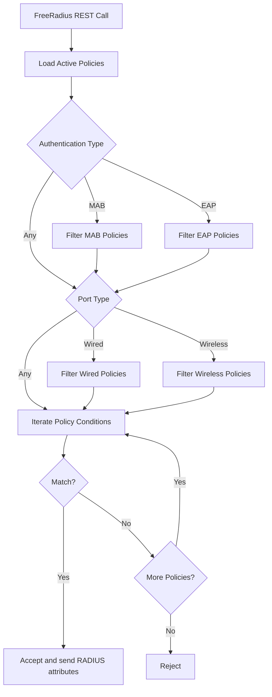
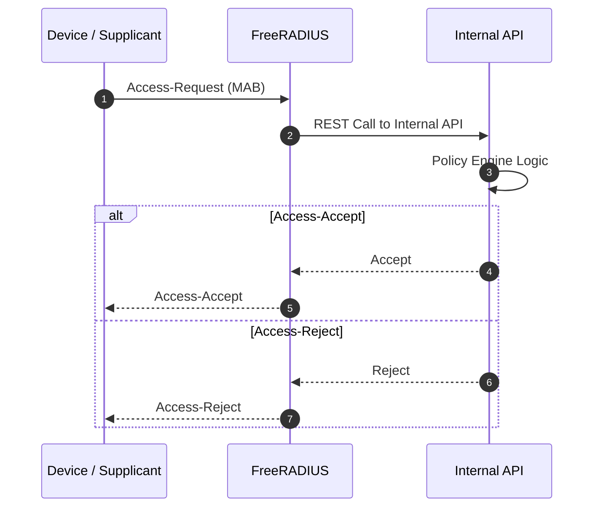

# Policies

Policies in CNaaS-NAC is a core concept.  
All default authentications will in some way pass through the policy engine.  

## Policy engine logic



## Radius attributes to match
Currently the attributes a policy can match on is the following.

A policy can have multiple conditions with two different match logic, **AND** or **OR**.

- **AND**, all conditions must match.
- **OR**, at least one condition must match.

| Attribute | Description |
| :--- | :--- |
| User-Name | MAC address in format: (00:00:00:00:00:00) or a EAP username |
| NAS-Identifier | Device hostname |
| NAS-Port-Id | Common name for port, ex: Ethernet1 |
| Calling-Station-Id | MAC address of the supplicant |
| Called-Station-Id | MAC address of the device |
| NAS-IP-Address | Device IP address |
| Realm | Domain of an EAP user |
| Ldap-Groups | When LDAP is enabled Ldap groups for the user can also be matched |
| Endpoint group | CNaaS-NAC internal group for mac-address based endpoints. |

## Radius sequence *simplified*



## Manual reject

If you would like to reject users inside policies, for example having a blackhole policy at priority 1.  
Add a Auth-Type: Reject reply. Attribute and value are case-sensitive.

```json
{
  ...
  "replies": [
    {
        "attribute": "Auth-Type",
        "value": "Reject"
    }
  ]
}
```

## Examples

### Simple example

```json
{
  "name": "Allow one mac to vlan 14",
  "description": "",
  "priority": 100, # Lower priority is matched first
  "match_logic": "AND", # AND or OR
  "client_type": "MAB", # None, MAB or EAP
  "port_type": "Ethernet", # None, Ethernet or Wireless-802.11
  "enabled": true,
  "conditions": [
    {
        "attribute": "calling_station_id",
        "operator": "==", # ==, !=, in, startswith, endswith, regex or in_list
        "value": "00:00:00:00:00:00"
    }
  ],
  "replies": [
    {
        "attribute": "Tunnel-Medium-Type",
        "value": "IEEE-802"
    },
    {
        "attribute": "Tunnel-Type",
        "value": "VLAN"
    },
    {
        "attribute": "Tunnel-Private-Group-Id",
        "value": "14"
    }
  ]
}
```

### List of replies

A list of replies can be done by adding the same attribute multiple times.
Ordering matters, the first attribute will be first in the list.

```json
{
  ...
  "replies": [
    {
        "attribute": "NAS-Filter-Rule",
        "value": "permit icmp any any"
    },
    {
        "attribute": "NAS-Filter-Rule",
        "value": "permit tcp any any"
    }
  ]
}
```
